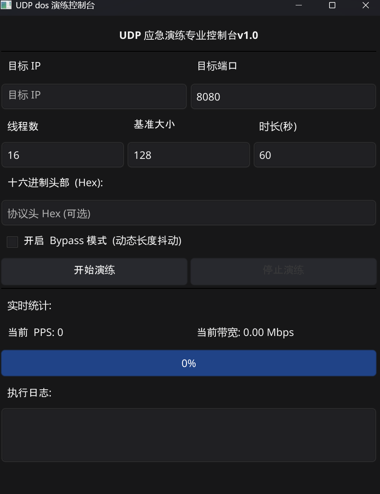

# utos

`utos` 是一个高性能、多平台的 UDP 网络压力测试工具，支持命令行 (CLI) 和图形界面 (GUI) 两种运行模式。

## ✨ 特性

- **高性能发包**：采用 Go 协程并发技术，支持多线程高速发包。
- **双模式运行**：
  - **CLI (命令行)**：适合服务器环境、自动化脚本。
  - **GUI (图形界面)**：基于 Fyne 库，适合桌面用户直观操作。
- **Bypass 模式**：内置动态包长抖动功能，模拟更真实的流量特征。
- **自定义协议头**：支持 Hex 格式的自定义载荷输入。
- **多平台支持**：支持 Windows, Linux, macOS 自动化构建。
- **流量控制**：支持 PPS (每秒数据包数) 限制。

## 🚀 快速开始

### 命令行版本 (CLI)

```bash
# 基础用法
./utos_cli -t 127.0.0.1 -p 80

# 开启 Bypass 模式并设置持续时间
./utos_cli -t 127.0.0.1 -p 80 -d 120 -B
```

**常用参数说明：**

- `-t, --target`: 目标 IP (必填)
- `-p, --port`: 目标端口 (默认 80)
- `-c, --threads`: 并发线程数 (默认 CPU 核心数 \* 2)
- `-d, --duration`: 持续时间，单位秒 (默认 60s)
- `-B, --bypass`: 开启动态包长抖动
- `-x, --hex`: 自定义 Hex 协议头

### 图形界面版本 (GUI)

直接运行 `utos_gui` 即可打开窗口。在界面中输入目标地址和参数后，点击“开始发送”即可开始任务。


## 🛠️ 编译与开发

### 环境要求

- Go 1.21+
- (Linux GUI 编译) 需要安装 X11 开发库：`sudo apt-get install libgl1-mesa-dev xorg-dev`

### 本地编译

```bash
# 编译 CLI
go build -o utos_cli ./cmd/cli

# 编译 GUI (Windows 下不带控制台)
go build -ldflags "-H windowsgui" -o utos_gui ./cmd/gui
```

## 📦 自动化构建

项目集成了 GitHub Actions。每次 Push 代码到仓库后，会自动在 **Actions** 选项卡中生成 Windows, Linux, macOS 三个平台的二进制文件，您可以直接前往下载。

## ⚖️ 免责声明

本工具仅用于授权情况下的网络压力测试、防御演练及学术研究。严禁用于任何非法网络攻击行为。使用者需自行承担因违规使用产生的法律责任。
